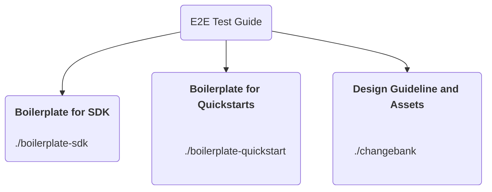

# Template for SDK's and Quickstarts
This is a template repo for creating FusionAuth quickstarts. If you're creating or modifying a quickstart or sdk,
follow these guidelines so we can maintain consistency.


# Repository Structure 



The `boilerplate-sdk` and `boilerplate-quickstart` directories contain the files that are used to create a new SDK or Quickstart, copy them into your new repository.


## Please modify the following files to fit your project:

### README.md
Describes the project and how to run it, it has some prefilled content.
- [Fusion Auth Content Style Guidelines](https://github.com/FusionAuth/fusionauth-site/blob/main/DocsDevREADME.md).
- [Basic writing and formatting syntax](https://docs.github.com/en/get-started/writing-on-github/getting-started-with-writing-and-formatting-on-github/basic-writing-and-formatting-syntax).


### docker-compose.yml
Example configuration of how to run it in a docker container.


### .github/ISSUE_TEMPLATE
Describes how and where issues should get reported, if you open .config you can see that some issues will be reported to other repositories if it's not directly related to the SDK or Quickstart for example if it's a FusionAuth Product related issue.
```
name: Create FusionAuth product related issue
url: https://github.com/FusionAuth/fusionauth-issues
```


### .github/workflows/playwright.yml
The GitHub workflow for the project. This file should be modified to describe how to run the project.

TODO: how to use and configure playwright


### .github/dependabot.yml
Dependabot checks for outdated dependencies and creates pull requests to update them.

The sections `# Maintain dependencies for GitHub Actions` and `# Maintain dependencies for Docker Compose` should remain the same but `# Maintain dependencies for complete-application` may need adjustments depending on the language/framework/plattform. In our default example we use `npm` but your project may relay on `yarn` or `dotnet-sdk` or some other [package-ecosystem](https://docs.github.com/en/code-security/dependabot/working-with-dependabot/dependabot-options-reference#package-ecosystem-).


### .github/workflows/release.yml
[Release Please](https://github.com/sonderformat-llc/release-please-prerelease-example) a SOC 2 compliant versioning workflow.


### CHANGELOG.md
Will be generated by [Release Please](https://github.com/sonderformat-llc/release-please-prerelease-example)


### CONTRIBUTING.md 
Describes how to contribute to the project.


### SECURITY.md
Links to the FusionAuth security guidelines and shows the support matrix.

---

## Please do not modify the following files:

`CODE_OF_CONDUCT.md` Links to the FusionAuth community guidelines.

`LICENSE` The Apache 2.0 license.

---

## Progress with the specific instructions for SDKs and Quickstarts.
* [SDK Instructions](INSTRUCTIONS-SDK.md)
* [QUICKSTART Instructions](INSTRUCTIONS-QUICKSTART.md)


