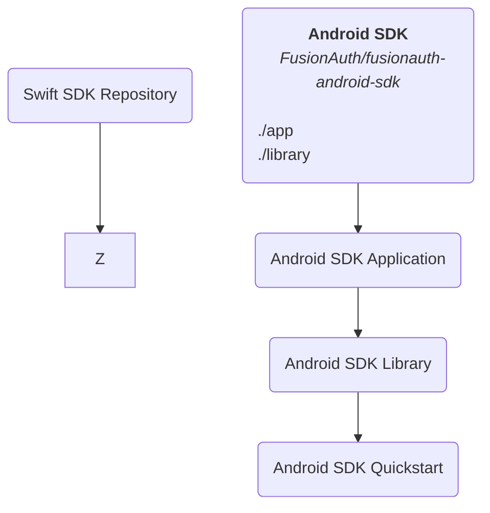
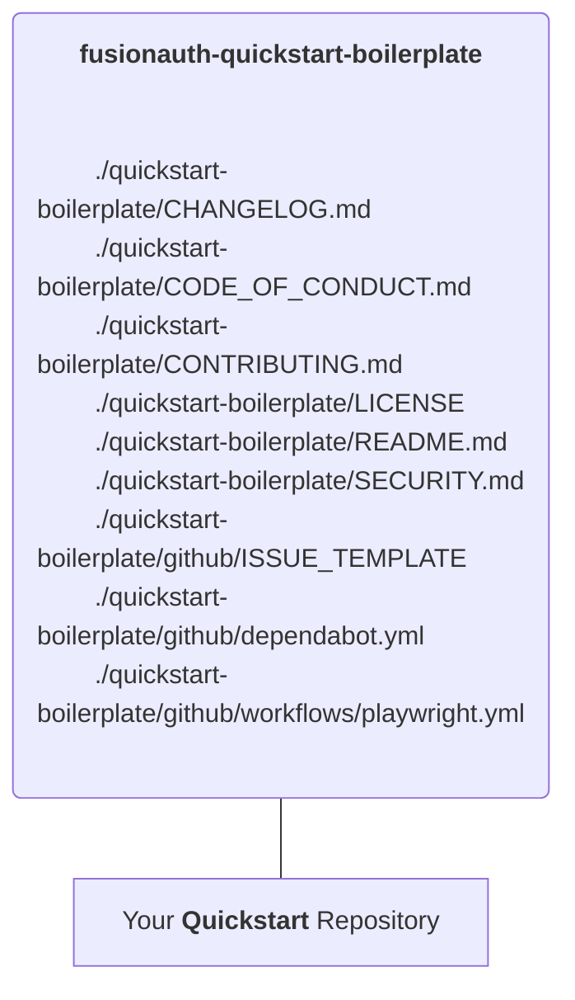
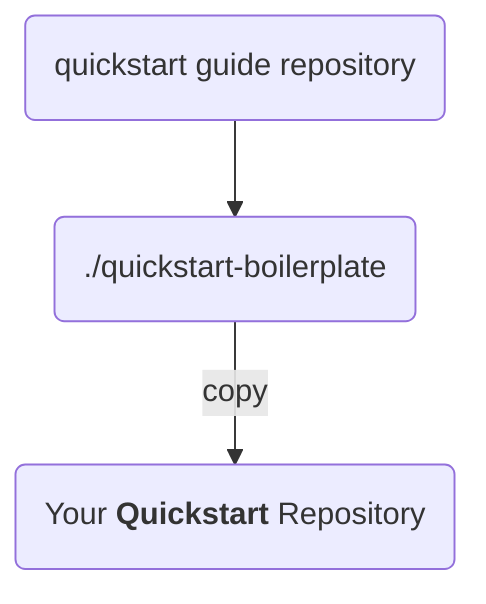

# Fusionauth Quickstart Template

This is a template repo for creating FusionAuth quickstarts. If you're creating or modifying a quickstart,
follow these guidelines so we can maintain consistency.

## Visual representation: How to setup a Quickstart or SDK repository

# SDK

